# flex

## flex所有的语法

|作用在容器上|作用在子项上|
|:--:|:--:|
|flex-direction|order|
|flex-wrap|flex-grow|
|flex-flow|flex-shrink|
|justify-content|flex-basis|
|align-items|flex|
|align-content|align-self|

没见过的水平垂直居中方式

```css
.parent {
  display: flex;
   width : 300px;
   height: 300px;
}
.son {
  width: 100px;
  height : 100px;
  margin : 0;
}
/*子元素水平垂直居中*/
```

## flex-direction

规定子项整体的布局方向 (左-右、右-左、上-下、下-上)【规定主轴方向】

|取值|含义|
|:--:|:--:|
|row|显示为行，从左到右 (默认值) |
|row-reverse|显示为行，从右向左|
|column|显示为列，从上到下|
|column-reverse|显示为列，从下到上 (从左下角往上排) |

## flex-wrap

当子元素的宽度大于父元素的宽度时，每个子元素会被压缩，我们设置的子元素的width就会失效;

|取值|含义|
|:--:|:--:|
|nowrap|单行显示，不换行 (默认值) 【自动压缩子项】|
|wrap|宽度不足，换行显示|
|wrap-reverse|宽度不足换行显示，但是换行后的子项在上面|

但是，子项里面的内容也需要占用空间，这就使得子项不能被无限压缩，他们仍会排在一行，但是他们就溢出父元素了

设置了wrap后，第一行和第二行会平分父级的高度

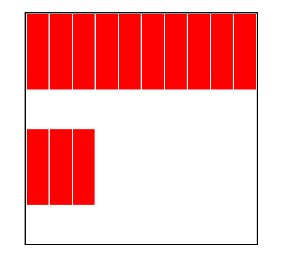

wrap-reverse效果图

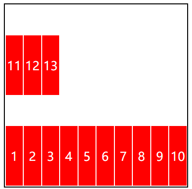

设置了主轴方向的宽度，交叉轴的高度会自动占满父元素

```html
<div class="parent">
  (<div class="son">
            <div class="box"></div>
        </div>
  )*10
</div>
```

```css
.parent {
    margin : 30px auto;
    border : 2px solid #000;
    display: flex;
    width : 300px;
    height : 300px;
    flex-direction: row;
}

.son {
    background-color : red;
    width : 30px;
    box-sizing: border-box;
    border : 1px solid #fff;
}
```

效果图：

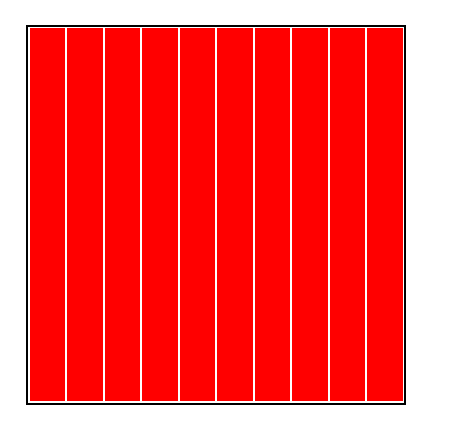

## flex-flow

flex-flow 是 ```flex-direction``` 和 ```flex-wrap``` 的缩写，中间用**空格**隔开

## justify-content

它决定了子项在主轴方向的对齐和分布方式

|取值|含义|
|:--:|:--:|
|flex-start|默认值，起始位置对齐|
|flex-end|结束位置对齐|
|center|居中对齐|
|space-between|两端对齐，空白间距只在元素中间区域分部|
|space-around|每个flex子项左右都环绕互不干扰的等宽的空白区域，最终视觉效果是两端的空白只有中间空白的一半|
|space-evenly|视觉上每个flex子项两侧的空白间距完全相同|

当元素排满不换行时，即使添加了space-XXX,他们中间是没有空白的，如果添加了  ```flex-wrap : wrap```时，第一行排满元素，第一行仍然没有空白，第二行的空白仍然遵循space-XXX

超出压缩没有空白

```html
<div class="parent">
        <div class="son">1</div>
        <div class="son">2</div>
        <div class="son">3</div>
        <div class="son">4</div>
        <div class="son">5</div>
        <div class="son">6</div>
    </div>
```

```css
.parent {
    width : 400px;
    height: 400px;
    border : 2px solid #000;
    display: flex;
    flex-direction: row;
    justify-content: space-evenly;
}

.son {
    box-sizing: border-box;
    width : 100px;
    height : 100px;
    background: red;
    text-align: center;
    line-height : 100px;
    border :2px solid green;
}
```

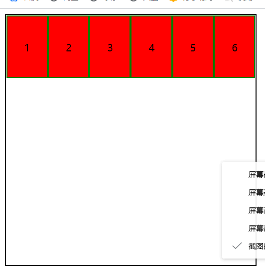

超出换行

```css
.parent {
    width : 400px;
    height: 400px;
    border : 2px solid #000;
    display: flex;
    flex-direction: row;
    justify-content: space-evenly;
    flex-wrap: wrap;
}

.son {
    box-sizing: border-box;
    width : 100px;
    height : 100px;
    background: red;
    text-align: center;
    line-height : 100px;
    border :2px solid green;
}
```

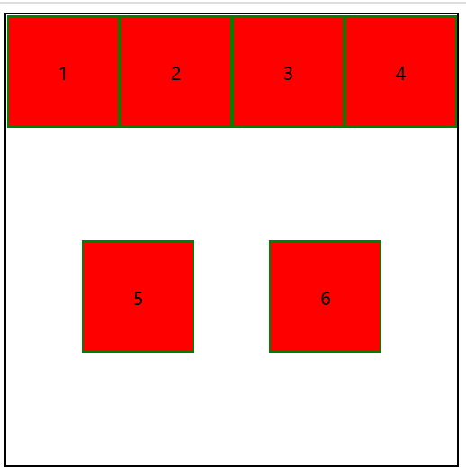

## align-items

子项在侧轴上的对齐方式

|取值|含义|
|:--:|:--:|
|stretch|默认值，flex子项拉伸|
|flex-start|起始位置对齐|
|flex-end|结束位置对齐|
|center|居中对齐|

当值为stretch时，子项会沿着侧轴延伸：

```css
.parent {
    width : 400px;
    height: 400px;
    border : 2px solid #000;
    display: flex;
    flex-direction: row;
    justify-content: space-evenly;
    flex-wrap: wrap;
    align-items: stretch;
}

.son {
    box-sizing: border-box;
    width : 100px;
    line-height: 100px;
    background: red;
    text-align: center;
    border :2px solid green;
    color : #fff;
    font-size : 30px;
}
```

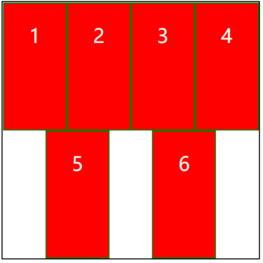

当我们设置另外三个值的时候，子项的高度就是内容撑起的高度了

```html
<div class="parent">
        <div class="son">测试文本测试文本测试文本测试文本测试文本测试文本</div>
        <div class="son">测试文本</div>
        <div class="son">测试文本测试文本</div>
        <div class="son">测试文本测试文本测试文本</div>
    </div>
```

```css
.parent {
    width : 400px;
    height: 400px;
    border : 2px solid #000;
    display: flex;
    flex-direction: row;
    justify-content: space-evenly;
    flex-wrap: wrap;
    align-items: flex-start;
}

.son {
    box-sizing: border-box;
    width : 100px;
    background: red;
    text-align: center;
    border :2px solid green;
    color : #fff;
    font-size : 30px;
}
```

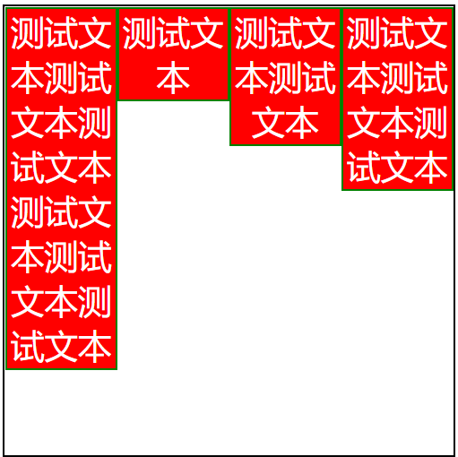

但是即使设置了align-items : flex-start 折行后依然第一行和第二行之间也会有很大间距

## align-content

align-content 和 justify-content 相似，只不过 align-content 控制的是交叉轴

|取值|含义|
|:--:|:--:|
|stretch|默认值，flex子项都等比例拉伸|
|flex-start|起始位置对齐|
|flex-end|结束位置对齐|
|center|居中对齐|
|space-between|两端对齐，空白间距只在元素中间区域分部|
|space-around|每个flex子项左右都环绕互不干扰的等宽的空白区域，最终视觉效果是两端的空白只有中间空白的一半|
|space-evenly|视觉上每个flex子项两侧的空白间距完全相同|

没有加 ```align-content : flex-start```

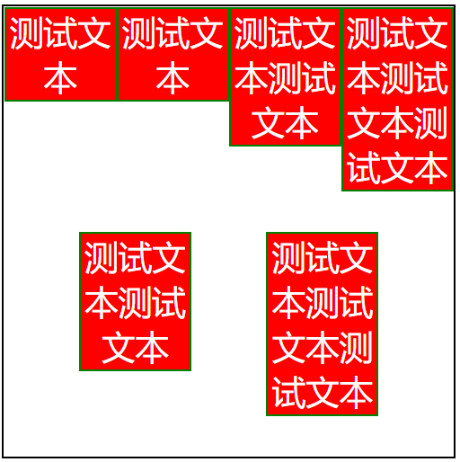

加上后：

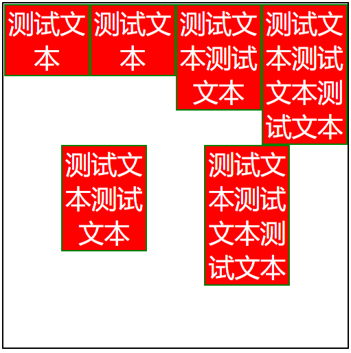

作用在子项上的属性

|属性|含义|
|:--:|:--:|
|order|可以通过改变order值来改变子项的排序方式，默认值是0，可正可负，值越小，子项越靠前|
|flex-grow|grow是扩展的意思，扩展的是子项所占的宽度拓展所侵占的空间是除去元素剩余的空白区域，所以，要想这个属性生效，就要有剩余的空白区域。默认值是0；剩余部分是1，当我们填的值大于等于1时，他就会填满剩余的空白空间，当我们填的值是零点几时，就不填满，而是占我们所填的数 ( 这个值不能是负数 ) 当子项的flex-grow的和超过了1，子项就会按照我们设置的flex-grow值比例将空白全部分配|
|flex-shrink|他处理当容器空间不足的时候单个子项的收缩比例默认值是1 (平均收缩) ，要想它产生效果，就要让容器空间不；0就是不收缩|
|flex-basis|它定义了元素分配剩余空间之前的默认的大小 ( 主轴上的宽度 ) |
|flex|flex是flex-grow flex-shrink 和 flex-basis的复合属性|
|align-self|他和align-items 相似的，只不过align-items设置的是一整行，而flex-self设置的是单个元素|

### order 效果

```html
<div class="parent">
        <div class="son">1</div>
        <div class="son">2</div>
        <div class="son">3</div>
        <div class="son">4</div>
        <div class="son">5</div>
        <div class="son">6</div>
    </div>
```

```css
.parent {
  width: 400px;
  height: 400px;
  border: 2px solid #000;
  display: flex;
}

.son {
  box-sizing: border-box;
  width: 100px;
  background: red;
  text-align: center;
  border: 2px solid green;
  color: #fff;
  font-size: 30px;
}

.son:nth-of-type(2) {
  order: 1;
}

.son:nth-of-type(4) {
  order: -1;
}

```

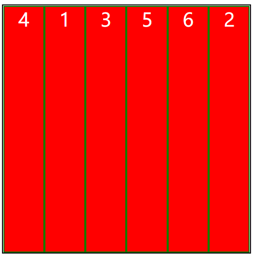

### flex-grow 是小数时的效果 (0.5就是占剩余空间的50%)

```html
<div class="parent">
        <div class="son">1</div>
        <div class="son">2</div>
        <div class="son">3</div>
    </div>
```

```css
.parent {
  width: 400px;
  height: 400px;
  border: 2px solid #000;
  display: flex;
  flex-wrap: wrap;
}

.son {
  box-sizing: border-box;
  width: 100px;
  background: red;
  text-align: center;
  border: 2px solid green;
  color: #fff;
  font-size: 30px;
}

.son:nth-of-type(2) {
  flex-grow: 1;
}
```

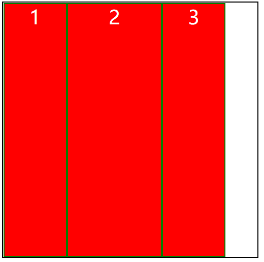

### flex-basis

配合 flex-wrap 一起使用，如果 flex-wrap 的值为 nowrap 的话，flex-basis 的作用不大，;相反，如果 flex-wrap 的值为 wrap 的话，flex容器根据 flex-basis 计算是否需要换行。

当 ```width``` 和 ·```flex-basis``` 同时存在时，flex-basis的优先级要高

不换行，当空间不足时，flex-basis没有任何效果

