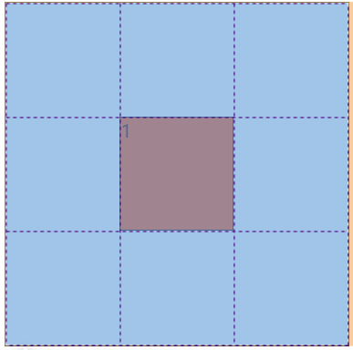
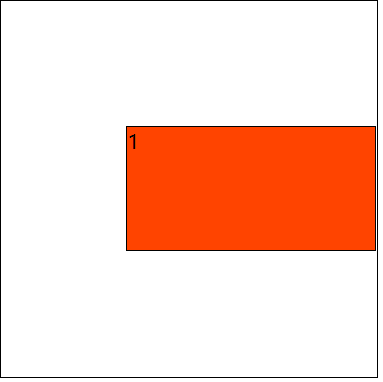
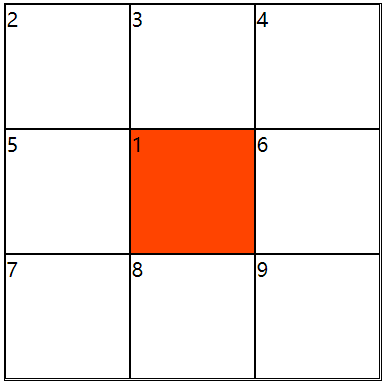
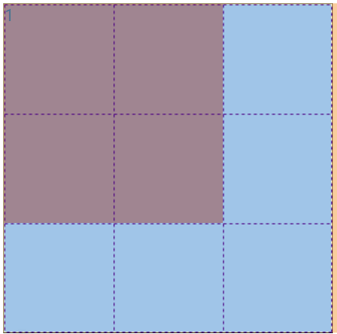
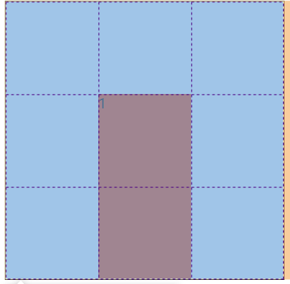

# grid

grid 是一个二维布局方法，横纵两个方向同时存在

grid 的所有属性

|作用在容器上|作用在子项上|
|:--:|:--:|
|grid-template-colums|grid-column-start|
|grid-template-rows|grid-column-end|
|grid-template-areas|grid-row-start|
|grid-template|grid-row-end|
|grid-colum-gap|grid-column|
|grid-row-gap|grid-row|
|grid-gap|grid-area|
|justify-items|justify-self|
|align-items|align-self|
|place-items|place-self|
|justify-content||
|align-content||
|place-content||

## grid-template-columns 和 grid-template-row

对网格进行横纵划分，形成二维布局；单位可以是 像素，百分比，em, auto和fr ( 网格剩余空间比例单位 )；如果需要多个横纵网格，可以用 ```repeat()``` 语法进行简化操作

- grid-template-row : 设置每一行的高度和行数
- grid-template-columns : 设置每一行的宽度和行数

```html
<div class="parent">
  div.son{$}*15
</div>
```

```css
.parent {
  display: grid;
  width: 500px;
  height: 500px;
  grid-template-columns: 5em 200px 100px 50px 50px;
  grid-template-rows: 200px 200px 100px;
}

.son {
  box-sizing: border-box;
  border: 1px solid #ddd;
}
```

## fr单位

当所有的fr总和大于1时，会占满所有区域，当fr总和小于1时，不会占满空白区域

```html
<div class="parent">
  div.son{$}*9
</div>
```

```css
.parent {
  display: grid;
  width: 300px;
  height: 300px;
  grid-template-columns: 1fr 1fr 2fr;
  grid-template-rows: 1fr 1fr 1fr;
  border: 1px solid #000;
}

.son {
  box-sizing: border-box;
  border: 1px solid #ddd;
}
```


当改为

```css
.parent{
  grid-template-columns: .1fr .1fr .2fr;
  grid-template-rows: .1fr .1fr .1fr;
}
```


## repeat()

```repeat(重复次数，数字+单位)```

## grid-template-areas 和 grid-template

grid-template-ares用于给我们的网格划分区域，此时grid子项只要设置grid-area属性，指定其隶属于哪个区域

```html
<div class="parent">
  div.son{$}*3
</div>
```

```css
.parent {
  display: grid;
  width: 300px;
  height: 300px;
  grid-template-columns: repeat(3, 1fr);
  grid-template-rows: repeat(3, 1fr);
  grid-template-areas:
  "A1 A1 A1"
  "A2 A2 A3"
  "A2 A2 A3";
}

.son {
  border: 2px solid #000;
  background-color: #d40;
  box-sizing: border-box;
}

.parent div:nth-child(1) {
  grid-area: A1;/*注意这里没有引号*/
}

.parent div:nth-child(2) {
  grid-area: A2;
}

.parent div:nth-child(3) {
  grid-area: A3;
}
```


注意： 在区域划分中不允许出现特殊图形，只能是矩形

grid-template是 grid-template-rows grid-template-columns 和 grid-template-areas的复合属性

改写上面的代码

注意： 列的前面要加一个斜杠

```css
.parent {
  grid-template:
  "A1 A1 A1" 1fr
  "A2 A2 A3" 1fr
  "A2 A2 A3" 1fr
  /1fr 1fr 1fr; /*注意： 列的前面要加一个斜杠*/
}
```

## grid-column-gap grid-row-gap 和 grid-gap

```grid-column-gap```  ```grid-row-gap``` 用于定义网格之间的间隙

```gird-gap``` 是这两个属性的复合属性，他的第一个值是 grid-row-gap;

当我们给子项设置了固定的宽高，那么我们设置gap的时候，他不会压缩子项，因此可能溢出父元素。

我们即使合并了多个单元格，但是里面的单个单元格的gap依然存在

```css
.parent{
  grid-template:
  "A1 A1 A1" 100px
  "A2 A2 A3" 100px
  "A2 A2 A3" 100px
  /100px 100px 100px;
  grid-row-gap: 10px;
}
```


## justify-items 和 align-items

- justity-item指定的**网格内部元素**的水平显示方式 ( 水平拉伸、左中右对齐 )
- align-item指定的**网格内部元素**的垂直显示方式 ( 垂直拉伸、上中下对齐 )

|取值|含义|
|:--:|:--:|
|stretch|默认值，拉伸；水平或垂直填充|
|start|左或上部对齐|
|end|右侧或底部对齐|
|center|水平或垂直居中|

如果设置了 ```justify-items: start``` 那么每个元素会在自己的网格内靠左对齐

```css
.parent {
  display: grid;
  grid-template-columns: repeat(3, 1fr);
  grid-template-rows: repeat(3, 1fr);
  width: 300px;
  height: 300px;
  justify-items: start;
  border: 1px solid #000;
}
.son {
  border: 1px solid #ddd;
  background-color: #f40;
}
```


place-items 是 justify-items 和 align-items复合属性;他的第一个值是align-items

## justify-content 和 align-content

- justify-content 定义了网格的水平分部方式
- align-content 定义了网格的垂直分部方式

|取值|含义|
|:--:|:--:|
|stretch|默认值，拉伸；水平或垂直填充|
|start|左或上部对齐|
|end|右侧或底部对齐|
|center|水平或垂直居中|
|space-between|两端对齐|
|space-around|享有独立不冲动的空白空间|
|space-evenly|平均享有空白空间|

```css
.parent {
  display: grid;
  grid-template-columns: repeat(3, 50px);
  grid-template-rows: repeat(3, 50px);
  width: 300px;
  height: 300px;
  border: 1px solid #000;
  justify-content: space-evenly;
}
.son {
  border: 1px solid #ddd;
  background-color: #f40;
}
```


place-content 是 justify-content 和 align-content的复合属性;第一个值为align-content

## 下面是子项的属性

|取值|含义|
|:--:|:--:|
|grid-column-start|水平方向上占据起始位置|
|grid-column-end|水平方向上占据结束位置 也可以写 ```span 数字``` 表示占用的网格数|
|grid-row-start|垂直方向上占据起始位置|
|grid-row-end|垂直方向上占据结束位置 也可以写 ```span 数字``` 表示占用的网格数|
|grid-column|grid-column-start 和 grid-column-end的复合属性 中间用 / 隔开|
|grid-row|grid-row-start 和 grid-row-end 的复合属性 中间用 / 隔开|
|grid-area|表示当前网格占用的区域 ( 常和grid-template一起用 ) |
|justify-self|单个网格元素内部的水平对齐方式|
|align-self|单个网格元素内部的垂直对齐方式|
|place-self|justify-self 和 align-self的复合属性|

注意：只有 end 才有span属性

## grid-column grid-row grid-conlumn-start grid-column-end grid-row-start grid-row-end

网格的每一条线都可以命名，对于一个3*3的表格， 从上到下的四条线依次是1 2 3 4，从左到右也是 1 2 3 4，grid-column-start 规定了这个单元格起始的位置

```html
<div class="parent">
  <div class="son"></div>
</div>
```

```css
.parent {
  display: grid;
  grid-template-columns: repeat(3, 1fr);
  grid-template-rows: repeat(3, 1fr);
  width: 300px;
  height: 300px;
  border: 1px solid #000;
}

.son {
  border: 1px solid #000;
}

.parent .son:nth-child(1) {
  grid-column: 2/3;
  grid-row: 2/3;
  background-color: #f40;
}
```



当我们换成 ```grid-column: 2/4``` 的时候，他就会占两个单元格



当内容排满以后，再使用grid-column会改变原来的排列顺序

```html
<div class="parent">
        <div class="son">1</div>
        <div class="son">2</div>
        <div class="son">3</div>
        <div class="son">4</div>
        <div class="son">5</div>
        <div class="son">6</div>
        <div class="son">7</div>
        <div class="son">8</div>
        <div class="son">9</div>
    </div>
```

```css
.parent {
  display: grid;
  grid-template-columns: repeat(3, 1fr);
  grid-template-rows: repeat(3, 1fr);
  width: 300px;
  height: 300px;
  border: 1px solid #000;
}

.son {
  border: 1px solid #000;
}

.parent .son:nth-child(1) {
  grid-column: 2/3;
  grid-row: 2/3;
  background-color: #f40;
}
```



```gird-column-end: span 2``` 表示占两个单元格


```html
<div class="parent">
  <div class="son"></div>
</div>
```

```css
.parent {
  display: grid;
  grid-template-columns: repeat(3, 1fr);
  grid-template-rows: repeat(3, 1fr);
  width: 300px;
  height: 300px;
  border: 1px solid #000;
}

.son {
  border: 1px solid #000;
}

.parent .son:nth-child(1) {
  grid-column: 2/span 2;
  grid-row: 2/3;
  background-color: #f40;
}
```

## grid-area

可以用grid-template-areas命名，也可以用数字

```html
<div class="parent">
        <div class="son">1</div>
    </div>
```

```css
.parent {
  display: grid;
  grid-template-columns: repeat(3,1fr);
  grid-template-rows: repeat(3,1fr);
  width: 30vw;
  height: 30vw;
  border: 1px solid #000;
  grid-template-areas:
  "a1 a1 a2"
  "a1 a1 a2"
  "a3 a3 a3";
}

.parent .son:nth-child(1){
  grid-area: a1;;
  background-color: #f40;
}
```



用数字时：```grid-area: 起始的横线/起始的竖线/结束的横线/结束的横线

```css
.parent {
  display: grid;
  grid-template-columns: repeat(3,1fr);
  grid-template-rows: repeat(3,1fr);
  width: 30vw;
  height: 30vw;
  border: 1px solid #000;
}

.parent .son:nth-child(1){
  grid-area: 2/2/4/3;
  background-color: #f40;
}
```



## justify-self 和 align-self 和 place-self

基本关键字：关键字值之一normal，auto或stretch。
基线对齐：baseline关键字，以及可选的一个first或last。
位置对齐：
：一center，start，end，flex-start，flex-end，self-start，self-end，left，或right。
加上可选safe或unsafe。
值
auto使用的值是值justify-items父母箱的财产，除非框中有没有父母，或绝对定位，在这些情况下，auto代表normal。

normal此关键字的效果取决于我们所处的布局模式：

在块级布局中，关键字是一个同义词start。
在绝对定位的布局中，关键字的行为就像start在被替换的绝对定位框上，以及stretch在所有其他绝对定位的框上一样。  
在表格单元格布局中，此关键字没有意义，因为此属性被忽略。
在flexbox布局中，此关键字没有意义，因为此属性被忽略。 
在网格布局中，这个关键字会导致类似的行为stretch，除了具有宽高比的框或其行为类似的内部大小start。
start物品在适当的轴线上朝向对齐容器的起始边缘彼此齐平地包装。

end物品在适当的轴线上朝向对齐容器的末端边缘彼此齐平。

flex-start根据柔性集装箱的主启动或交叉启动侧，物品朝向对齐容器的边缘彼此齐平。

这仅适用于柔性布局项目。对于不是柔性容器的子项的项目，该值被视为像start。

flex-end根据柔性容器的主端或交叉端侧，物品朝向对齐容器的边缘彼此齐平地包装。

这仅适用于柔性布局项目。对于不是柔性容器的子项的项目，该值被视为像end。

self-start该物品与相应轴的物品开始侧的对齐容器边缘齐平。

self-end该物品与物品端侧的对齐容器边缘齐平，并放置在相应的轴上。

center物品朝向对齐容器的中心彼此齐平。

left物品朝向对齐容器的左边缘彼此齐平。如果属性的轴不与内联轴平行，则该值的行为类似start。

right物品在适当的轴线上朝向对齐容器的右边缘彼此齐平地包装。如果属性的轴不与内联轴平行，则该值的行为类似start。

baseline

  first baseline

last baseline指定参与第一次或最后一次基线对齐：将框的第一个或最后一个基准集的对齐基线与其基准共享组中所有框的共享第一个或最后一个基准集中的相应基线对齐。

回退对齐first baseline是start，last baseline是的end。

stretch如果物品的组合尺寸小于对齐容器的auto尺寸，则任何尺寸的商品的尺寸均等（不成比例地增加），同时仍尊重由max-height/ max-width（或等效功能）施加的约束，以使组合尺寸准确地填充对齐容器。

safe如果项目的大小溢出对齐容器，则对齐项目就像对齐模式一样对齐start。

unsafe无论物品和对齐容器的相对大小如何，给定的对齐值都会得到遵守.
