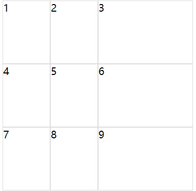
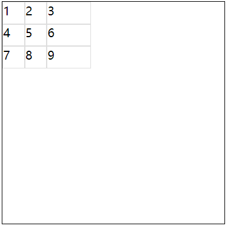
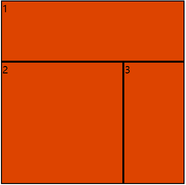
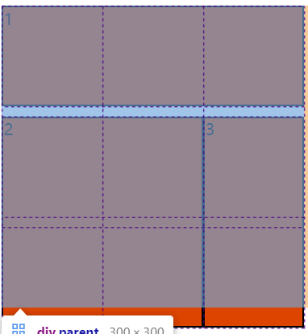
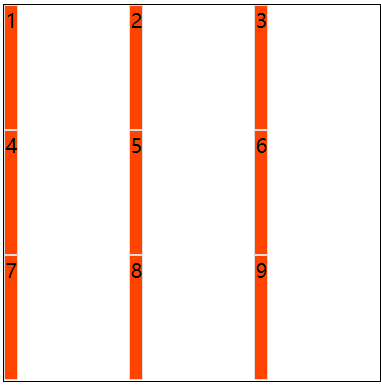
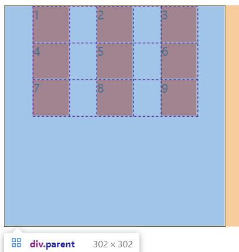

# grid

grid 是一个二维布局方法，横纵两个方向同时存在

grid 的所有属性

|作用在容器上|作用在子项上|
|:--:|:--:|
|grid-template-colums|grid-column-start|
|grid-template-rows|grid-column-end|
|grid-template-areas|grid-row-start|
|grid-template|grid-row-end|
|grid-colum-gap|grid-column|
|grid-row-gap|grid-row|
|grid-gap|grid-area|
|justify-items|justify-self|
|align-items|align-self|
|place-items|place-self|
|justify-content||
|align-content||
|place-content||

## grid-template-columns 和 grid-template-row

对网格进行横纵划分，形成二维布局；单位可以是 像素，百分比，em, auto和fr ( 网格剩余空间比例单位 )；如果需要多个横纵网格，可以用 ```repeat()``` 语法进行简化操作

- grid-template-row : 设置每一行的高度和行数
- grid-template-columns : 设置每一行的宽度和行数

```html
<div class="parent">
  div.son{$}*15
</div>
```

```css
.parent {
  display: grid;
  width: 500px;
  height: 500px;
  grid-template-columns: 5em 200px 100px 50px 50px;
  grid-template-rows: 200px 200px 100px;
}

.son {
  box-sizing: border-box;
  border: 1px solid #ddd;
}
```

## fr单位

当所有的fr总和大于1时，会占满所有区域，当fr总和小于1时，不会占满空白区域

```html
<div class="parent">
  div.son{$}*9
</div>
```

```css
.parent {
  display: grid;
  width: 300px;
  height: 300px;
  grid-template-columns: 1fr 1fr 2fr;
  grid-template-rows: 1fr 1fr 1fr;
  border: 1px solid #000;
}

.son {
  box-sizing: border-box;
  border: 1px solid #ddd;
}
```



当改为

```css
.parent{
  grid-template-columns: .1fr .1fr .2fr;
  grid-template-rows: .1fr .1fr .1fr;
}
```



## repeat()

```repeat(重复次数，数字+单位)```

## grid-template-areas 和 grid-template

grid-template-ares用于给我们的网格划分区域，此时grid子项只要设置grid-area属性，指定其隶属于哪个区域

```html
<div class="parent">
  div.son{$}*3
</div>
```

```css
.parent {
  display: grid;
  width: 300px;
  height: 300px;
  grid-template-columns: repeat(3, 1fr);
  grid-template-rows: repeat(3, 1fr);
  grid-template-areas:
  "A1 A1 A1"
  "A2 A2 A3"
  "A2 A2 A3";
}

.son {
  border: 2px solid #000;
  background-color: #d40;
  box-sizing: border-box;
}

.parent div:nth-child(1) {
  grid-area: A1;/*注意这里没有引号*/
}

.parent div:nth-child(2) {
  grid-area: A2;
}

.parent div:nth-child(3) {
  grid-area: A3;
}
```



注意： 在区域划分中不允许出现特殊图形，只能是矩形

grid-template是 grid-template-rows grid-template-columns 和 grid-template-areas的复合属性

改写上面的代码

注意： 列的前面要加一个斜杠

```css
.parent {
  grid-template:
  "A1 A1 A1" 1fr
  "A2 A2 A3" 1fr
  "A2 A2 A3" 1fr
  /1fr 1fr 1fr; /*注意： 列的前面要加一个斜杠*/
}
```

## grid-column-gap grid-row-gap 和 grid-gap

```grid-column-gap```  ```grid-row-gap``` 用于定义网格之间的间隙

```gird-gap``` 是这两个属性的复合属性，他的第一个值是 grid-row-gap;

当我们给子项设置了固定的宽高，那么我们设置gap的时候，他不会压缩子项，因此可能溢出父元素。

我们即使合并了多个单元格，但是里面的单个单元格的gap依然存在

```css
.parent{
  grid-template:
  "A1 A1 A1" 100px
  "A2 A2 A3" 100px
  "A2 A2 A3" 100px
  /100px 100px 100px;
  grid-row-gap: 10px;
}
```



## justify-items 和 align-items

- justity-item指定的**网格内部元素**的水平显示方式 ( 水平拉伸、左中右对齐 )
- align-item指定的**网格内部元素**的垂直显示方式 ( 垂直拉伸、上中下对齐 )

|取值|含义|
|:--:|:--:|
|stretch|默认值，拉伸；水平或垂直填充|
|start|左或上部对齐|
|end|右侧或底部对齐|
|center|水平或垂直居中|

如果设置了 ```justify-items: start``` 那么每个元素会在自己的网格内靠左对齐

```css
.parent {
  display: grid;
  grid-template-columns: repeat(3, 1fr);
  grid-template-rows: repeat(3, 1fr);
  width: 300px;
  height: 300px;
  justify-items: start;
  border: 1px solid #000;
}
.son {
  border: 1px solid #ddd;
  background-color: #f40;
}
```



place-items 是 justify-items 和 align-items复合属性;他的第一个值是align-items

## justify-content 和 align-content

- justify-content 定义了网格的水平分部方式
- align-content 定义了网格的垂直分部方式

|取值|含义|
|:--:|:--:|
|stretch|默认值，拉伸；水平或垂直填充|
|start|左或上部对齐|
|end|右侧或底部对齐|
|center|水平或垂直居中|
|space-between|两端对齐|
|space-around|享有独立不冲动的空白空间|
|space-evenly|平均享有空白空间|

```css
.parent {
  display: grid;
  grid-template-columns: repeat(3, 50px);
  grid-template-rows: repeat(3, 50px);
  width: 300px;
  height: 300px;
  border: 1px solid #000;
  justify-content: space-evenly;
}
.son {
  border: 1px solid #ddd;
  background-color: #f40;
}
```



place-content 是 justify-content 和 align-content的复合属性;第一个值为align-content

## 下面是子项的属性

|取值|含义|
|:--:|:--:|
|grid-column-start|水平方向上占据起始位置|
|grid-column-end|水平方向上占据结束位置|
|grid-row-start||
|grid-row-end||
|||