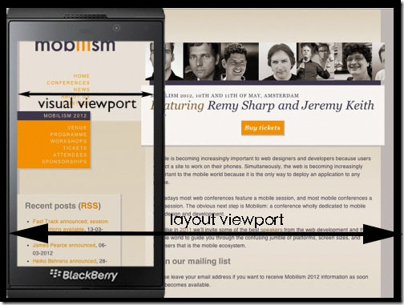

# 移动端布局

## viewport视口

在移动端视口就是浏览器显示页面的内容的屏幕区域。

在viewport中有两种视口：

- visual viewport 固定大小和屏幕大小相同
- layout viewport 默认大小是 980px , 可以通过 ```document.documentElement.clientWidth``` 来获取

现代网页需要将 ```layout viewport``` 设置和 ```visual viewport``` 相同大小，方便进行网页制作

### visual viewport

screen.width和screen.height，主要是用来获取整个屏幕的大小的，而window.innerWidth和window.innerHeight只是获取浏览器可用显示区域的大小，也就是浏览器中间负责显示的部分。当浏览器全屏时，要去掉状态栏、标签栏、任务栏等区域，当浏览器非全屏时，其值更小。由于在移动端，浏览器一般都是全屏的，所以大多数情况下screen.width与window.innerWidth的值相等，也有的博客中说用screen.width和screen.height来获取visual viewport的大小，就是这个原因。

visual viewport是我们可以直观看到的，不严谨的说，就是差不多等于手机屏幕的大小，偏向于一个物理概念

### layoutviewport

这是一个虚拟的窗口，其大小比手机屏幕大，加载网页时，直接把HTML渲染在这个虚拟的窗口中，这样就不会样式错乱了。在查看的时候，毕竟手机的visual viewport小啊，那就只能通过滚动条来看了。

做个比喻，layout viewport就是一张大白纸，HTML的内容就写在这个大白纸上，visual viewport就是一个放大镜，上下左右移动，可以显示其中的一部分。

Layout viewport的大小可以通过document.documentElement.clientWidth和document.document.clientHeight，实际使用中可能会有一些兼容问题，这跟DOCTYPE声明有关。不同浏览器的layout viewport大小不同，常见的有980px、1024px。



### viewport设置

通过