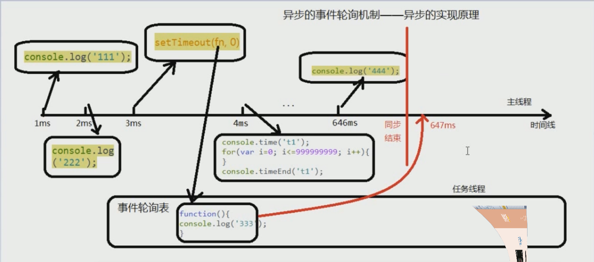

# 异步、Buffer缓存区、文件操作

## 回调函数

(回调函数时异步的实现方式)

回调函数的概念 ： 回调函数简称回调，将一个函数传入另一个函数中，在他的执行过程中根据时机或条件决定是否调用传入的函数

定时器就是一个典型的回调函数的例子

```js
//main
function callback () {
  console.log(1);
}
setInterval(callback, 1000);
```

回调函数的实现机制 ：

- 定义一个回调函数
- 将回调函数的函数引用地址作为参数传递给调用者(调用者就是另一个函数)
- 当特定的事件或条件发生的时候调用者使用函数指针调用回调函数对事件进行处理

回调函数的应用 ：

先来看一看错误的代码 :

```js
function getData () {
  const xhr = new XMLHttpRequest();
  let data;
  xhr.open("GET", './package-lock.json');
  xhr.send();
  if(xhr.status === 200){
    if(xhr.readyState === 4){
      data = xhr.responseText;
    }
  }
  return data;
}

let data = getData();
console.log(data);
```

这样返回的就是 undefined， 因为他们是异步执行的，这时候，我们用回调函数来解决

```js
function getData (callback) {
  const xhr = new XMLHttpRequest();
  let data;
  xhr.open("GET", './package-lock.json');
  xhr.send();
  if(xhr.status === 200){
    if(xhr.readyState === 4){
      data = xhr.responseText;
      callback(data);
    }
  }
  return data;
}

getData(function (data) {
  var newData = JSON.parse(data);
  console.log(newData);
});
```

## 异步和同步

- 同步 ： 一个任务等待前一个任务执行完成之后再执行。程序的执行顺序和程序的排列顺序是一致的
- 异步 ： 遇到一个任务，我们通过回调函数的形式来做成异步模式，后一个任务不等上一个任务执行完成就执行

### 异步的轮询机制

setTimeout 和 setInterval 都有一个最小时间，不同的操作系统的时间不同，windows一般是15ms， mac一般是10ms(即使写的是0ms),这是一个保护机制，防止CPU烧掉

所以下面的代码的 ```333``` 是最后输出的

```js
console.log(111);
console.log(222);
setTimeout(()=> {
  console.log(333)
}, 0);
console.log(444);
```

异步的代码永远在同步的代码之后执行

异步轮询机制-异步原理图：



### 异步编程的实现

在nodejs中，有三种实现方式

- 回调函数 ： 回调函数不一定是异步，但是异步一定有回调函数
- 事件(基于回调) : 事件不仅仅是前端才有，后端也有事件
- promise

我们看一个有回调函数但是是同步的例子：

```js
let arr = [1,2,3,4];
arr.forEach(function (value, index) {
  console.log(value, index);
})
```

node事件的语法：

```js
事件源.on('事件名称',回调函数);
```

node是支持utf-8，他是不支持gbk的

我们看一个node事件的例子：

```js
var http = require('http');
var server = http.createServer();
server.on('request', function (request, response){
  response.writeHead(200,{"Content-Type": "text/html;charset=utf-8"});
  response.write("<h1>你正在访问我的node服务器</h1>");
  response.end();
});
server.listen(80,function () {
  console.log("服务器正在运行");
})
```

promise概念：promise是ES6新增的我对象，用于对异步的操作进行消息的传递

promise的三种状态：

- pending 等待
- resolved 成功
- rejected 失败

只有两种状态的变化：pending => resolved;  pending => rejected

由于异步的执行顺序不可控，我们用promise来统一执行顺序

我们看一个promise的例子：

```js
const fs = require('fs');

let p1 = new Promise((resolve, reject)=>{
  fs.readFile('./module.js',(error, data) => {
    if(error){
      reject(error);
    }else{
      resolve(data);//将数据交给resolve
    }
  });
})

p1.then(res => {
  console.log(res.toString());
}, err => {
  console.log('错误');
})
```

## 缓存区(buffer) [了解即可]

js语言自身只有字符串类型的数据，没有二进制数据类型，二进制可以存储电脑中所有的数据

nodejs是服务端在处理TCP流或者文件流(文件流也称为字节流)时必须用到二进制数据。因此在nodejs中定义了一个buffer类，该类用来创建一个专门存放二进制数据的缓存区

(在内存区开辟一块临时内存来存放数据)

### 创建缓存区

- 创建指定长度的缓存区

```js
let buf = new Buffer.alloc(要开辟的字节大小);
```

```js
let buf = new Buffer.alloc(10);
//通过write来写入内存
buf.write('a');
console.log(buf);
//Buffer(10) [97, 0, 0, 0, 0, 0, 0, 0, 0, 0]
```

在gbk中，中文字符占2个字节，在utf-8中，占3个字节

-按照指定的数组(数组里面是十进制编码)创建缓存区

```js
let bf = new Buffer.from([97,98,99]);
console.log (bf.toString());//abc
```

- 按指定字符创建缓存区

```js
let bf = new Buffer.from('djfkds');
console.log (bf.toString());//abc
```

- Buffer.alloc(size[, fill[, encoding]])： 返回一个指定大小的 Buffer 实例，如果没有设置 fill，则默认填满 0
- Buffer.allocUnsafe(size)： 返回一个指定大小的 Buffer 实例，但是它不会被初始化，所以它可能包含敏感的数据
- Buffer.allocUnsafeSlow(size)
- Buffer.from(array)： 返回一个被 array 的值初始化的新的 Buffer 实例（传入的 array 的元素只能是数字，不然就会自动被 0 覆盖）
- Buffer.from(arrayBuffer[, byteOffset[, length]])： 返回一个新建的与给定的 ArrayBuffer 共享同一内存的 Buffer。
- Buffer.from(buffer)： 复制传入的 Buffer 实例的数据，并返回一个新的 Buffer 实例
- Buffer.from(string[, encoding])： 返回一个被 string 的值初始化的新的 Buffer 实例

写入缓存区 ```bf.write()```
读取缓存区 ```bf.toString()```
拷贝缓存区  ```buf.copy(buf1)```

```js
let buf1 = new Buffer.alloc(3);
buf1.write('我');
let buf2 = new Buffer.alloc(3);
buf1.copy(buf2);
console.log(buf2.toString());//我
//注意：括号里的是拷贝到的缓存区
```

## fs文件基本操作

文件操作要用到 ```fs``` 模块(文件系统模块)

### 文件读取

文件读取有两种方式

- 直接读取 ： 将硬盘上的东西读到内存上才触发回调函数
- 流式读取 ： 将数据从硬盘上读取一节就触发回调函数，像这样多次读取硬盘数据，多次调用回调函数，来实现大文件的操作

直接读取文件--异步：

readFile语法 ：

```js
let fs = require('fs');
fs.readFile(文件路径,编码,回调函数(err, data) => {});
//回调函数的参数，错误在前，数据在后
```

```js
let fs = require('fs');

fs.readFile('./module.js', 'utf-8',(err, data) => {
  console.log(data);
})
```

直接读取文件--同步

同步用到函数readFileSync

```js
let fs = require('fs');
let data = fs.readFileSync('./module.js', 'utf8');
console.log(data);
```

注意 ： 几乎所有 ```fs``` 函数都有同步的版本，只需要在函数的后面加看上Sync即可

### 写入文件

- 直接写入 ： 同步和异步
- 流式写入

我们用到函数 ```writeFile('文件路径', 要写入的内容， 回调函数(err) => {})```

```js
let fs = require('fs');
const hello = "hello node";
fs.writeFile('hello.txt',hello, (err) => {
  if(err){
    throw err;
  }else{
    console.log('写入成功');
  }
})
```

他的同步版本是writeFileSync

### 读取文件信息

```fs.stat(path, callback(err, state))``` state 是文件信息对象，他包含了许多文件信息

state上面有一个isFile()方法 ，判断是否是一个文件；
还有一个isDirectory(), 判断是不是一个目录(文件夹)

### 删除文件

删除文件：

```fs.unlink(path, callback(err) => {})```

```js
let fs = require('fs');
fs.unlink('./hello.txt', err => {
  if(!err){
    console.log('删除成功');
  }
});
```

删除空目录：

```fs.rmdir(path, callback)```

递归删除非空目录 ：

```js
const { Console } = require('console');
let fs = require('fs');
/**
 * 递归删除非空目录
*/
function deldir (path) {
  var files = fs.readdirSync(path);
  files.forEach((item) => {
    var newPath = `${path}/${item}`;
    var stats = fs.statSync(newPath);
    if(stats.isFile()){
      fs.unlinkSync(newPath);
    }else{
      arguments.callee(newPath);
    }
  });
  fs.rmdirSync(path);
}
deldir('./data');
```

### fs流(stream)读写方式

什么是流 ： 所有互联网的数据都是以流的方式传输的，流是一组有起点有终点的数据传输方式

#### 流的操作

- 流式读取文件 ：

一节一节的读取文件，一节是64kb

看例子 ：

```js
let fs = require('fs');
/** 创建一个可读流 */
var stream = fs.createReadStream('node_modules/@types/jquery/JQuery.d.ts');
/** 架管道 绑定data事件 */
stream.on('data', (data) => {
  console.log(data.toString());
})
```

- 以流的方式写入文档 : 一节一节的读取数据. (注意：输入完一定要以end结束)

写入流的两个事件 ： finish(完成事件)  error(发生错误时的事件)

```js
let fs = require("fs");

var stream = fs.createWriteStream('./hello.txt');

stream.write('hello');
stream.write('node');
stream.end();
```

### 管道方式

管道是nodejs中流的实现机制，直接定义一个输出流，导入输入流

语法 ：

```js
输出流.pipe(输入流)
```

```js
let fs = require("fs");

let s1 = fs.createReadStream('./node_modules/@types/jquery/JQuery.d.ts');
let s2 = fs.createWriteStream('./1.txt');

s1.on('data', (data) => {
  s2.write(data);
});

s1.on('end', () => {
  s2.end();
  console.log('写入完成');
});
```

我们再来用pipe实现

```js
let fs = require("fs");

let s1 = fs.createReadStream('./node_modules/@types/jquery/JQuery.d.ts');
let s2 = fs.createWriteStream('./1.txt');

s1.pipe(s2);
```

### 链式流

定义 ： 将多个管道连接起来，实现链式处理

使用链式流实现大文件压缩

```js
const fs = require('fs');
const zlib = require('zlib');

const s1 = fs.createReadStream('./node_modules/@types/jquery/JQuery.d.ts');
s1.pipe( zlib.createGzip() )
.pipe(fs.createWriteStream('./1.zip'));
```
