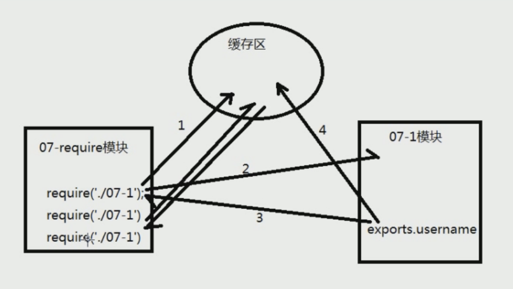
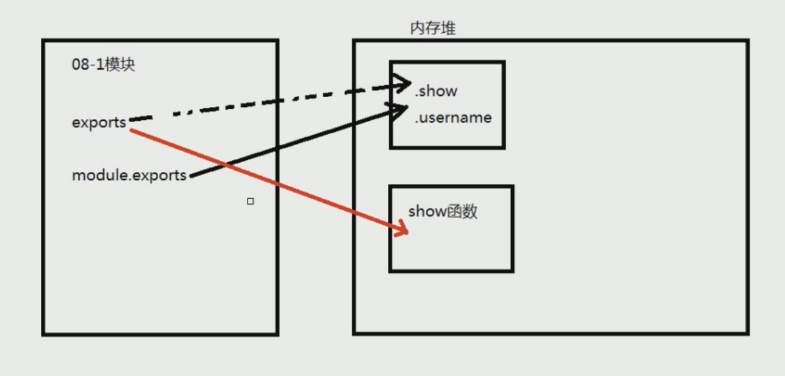

# node

## 运行nodejs

- REPL 模式（我们一般不用这种模式） ： 在命令行中输入node 或者直接在文件中打开 node.exe 的文件 (交互式命令解析器)，可以直接在命令行编写js代码， 只适合做测试用， 类似于python的repl 、 idle

- 运行js文件 ``node first.js```

## 模块

### 1.什么是模块

Nodejs 采用模块化管理和组织代码， nodejs所有的功能都在模块中。每一个文件就是一个模块，所有我们编写的代码会自动封装在一个模块中

### 2.自定义模块

我们通过 ```require('路径')``` 来引入模块， nodejs 他是同步的，所以我们在这里就不需要回调函数

```exports``` 叫做暴露对象，我们将需要暴露的变量添加到这个对象的上面。暴露对象可以将里面的内容暴露到引用处

```js
//这个是要引入的模块  名字  module.js
var firstName = '神尾观铃';
exports.firstName = firstName;
```

```js
var obj = require('./module.js');
console.log(obj);
//{firstName: '神尾观铃'}
```

也可以将函数放进去

```js
//module.js
exports.show = function () {
  console.log("Hello node!");
}
```

```js
var obj = require('./module.js');

console.log(obj);
obj.show();
// { show: [Function (anonymous)] }
// Hello node!
```

### 3.主模块

我们直接运行的就是主模块  (或者说我们直接node xxx.js 的就是主模块)  主模块去调用各种模块

主模块只允许存在一个， 我们通常命名为main.js /  index.js  / app.js

主模块是整个项目的启动模块，主模块对其他模块进行统筹和调度

### 4.模块组成

模块就是一个文件，但同时文件或者说一个模块，也是一个函数

```js
/**
 *  这是一个node模板文件叶也是一个函数
 */
console.log(arguments.callee.toString());

//输出的内容
// function (exports, require, module, __filename, __dirname) {
//   /**
//    *  这是一个node模板文件叶也是一个函数
//    */
//   console.log(arguments.callee.toString());
//   }
```

我们写的代码都会自动封装到一个函数中，这个函数共有五个参数 ：

- exports 将模块中数据暴露给引入的地方
- require 引用模块的函数
- module 模块对象，包含了当前模块的所有信息
- _filename 当前模块的文件名（他的路径）
- _dirname 当前模块所在的路径(目录的路径)

### 5.node模块代码规范

nodejs 采用了 commonJS 规范 来定模块 ； commonJS 是服务器端的 ```同步``` 文件加载规范

## require

### require 自定义模块

当模块中没有返回值的时候，在另一个文件中接收到的不是 undefined ，而是一个空对象

```js
//module.js
console.log('1');
```

```js
//main.js
let obj = require('./module');
console.log(obj);
//1
//{}
```

require 函数 ： 在当前模块中加载另外一个模块

注意 ：

- 子模块没有返回数据时，返回空对象
- 子模块在用 require 引入时，必须加 ```./``` 表示当前路径， (因为在node中默认的模块路径是 ```node_modules``` 路径中去寻找)
- 在用require引入时，可以省略 ```.js```

#### 模块分类

- 1)自定义模块 ： 我们自己写的模块就是自定义模块  ```require('./文件名')```
- 2)第三方模块 ： 第三方程序员或公司提供的库， 我们需要下载(安装可能要用到npm包管理工具) ```require('模块名')```
- 3)系统模块 ： node.js开发团对已经写好的库，我们直接引入即可使用

我们通过 ```npm install 要安装的包的名字```

我们安装的包都是存放在 node_modules文件中，所以 node 默认的模块路径是 node_modules文件夹

#### require() 函数的注意事项

- 当引入的模块存在语法错误时会报错
- 当要引入的模块不存在时会报错
- 当多次引入同一模块时模块中的代码只会执行一次，将暴露的对象直接写入缓存以后就直接从缓存中读取

虽然多次引入多次引入同一模块时，模块只执行一次，但是我们可以将返回结果赋给不同的变量

```js
//main.js
let a = require('module');
let c = require('module');
let b = require('module');
console.log(a,b,c);//他们都能返回exports中的对象
```

原理 ： 当首次导入模块时，他会先看看缓存区是否有，当缓存区（缓存区在内存中， 由于读取内存中是很快的， 这是node代码能够高速执行的原因之一） 没有时，再去读取硬盘上的内容，然后硬盘返回一份数据给require，然后再在缓存区存储一份，下次在引入的时候，就直接读取缓存区的内容了

看原理图：



## exports 导出对象

用于导出模块的共有方法和属性，其他的模块通过require得到的就是exports对象

语法：

```js
exports.属性名 = 值;
exports.方法名 = 值;
```

exports 的注意事项：

- ```exports``` 是 ```module。exports``` 对象的引用
- ```exports``不能更改指向，只能添加属性和方法

用下面的代码来解释

```js
//module
function show () {
  console.log(`111`);
}
exports.show = show;
```

```js
//main
let obj = require('./module);
console.log(obj);//输出的是一个空对象{}
```

先看原理图 



exports 和  module.exports 都指向同一个堆内存，当我们将export的指向改成另一块存着function的堆内存后，由于这块新的function不是暴露的，所以获得的就是一个空对象

解决方法 ： 我们可以先将函数暴露，然后再改变exports的指向

```js
//module
function show () {
  console.log(`111`);
}
exports.show = show;
exports = show;
```

```js
//main
let obj = require('./module');
console.log(obj);//输出内容是 {show : f};
```

或者是我们直接用module.exports

```js
//module
function show () {
  console.log(`111`);
}
module.exports = show;
/*
输出的结果是：
ƒ show () {
  console.log(`111`);
}
*/
```

## module模块对象

module  模块对象 ：

- module.exports : 这个才是真正的暴露对象， 他可以更改指向
- module.id : 模块的路径， 如果是主模块，里面的值就是 ```.```, 如果是子模块， 里面存放的就是子模块的绝对路径
- module.parent : 模块的父级，就是父级的module对象
- module.filename : 模块的路径和文件名
- module.children : 他是一个数组，存放着子模块路径的数组
- module.paths : 这也是一个数组， 他每一项都是要去找node_modules文件夹，第一项是当前路径的node_modules文件夹，第二项是上一级目录的node_module文件夹，一次类推，最后一项是根目录的 node_modules 文件夹路径

## npm包管理工具

用来安装第三方开发者的模块   NPM(node packge manager) : 是基于node.js 的包管理工具

package.json : 是node.js 的包描述文件，以json格式描述项目

## nodejs 作用域

一个文件就是一个模块(函数)，我们通过var在模块中定义的变量是属于局部作用域的。
