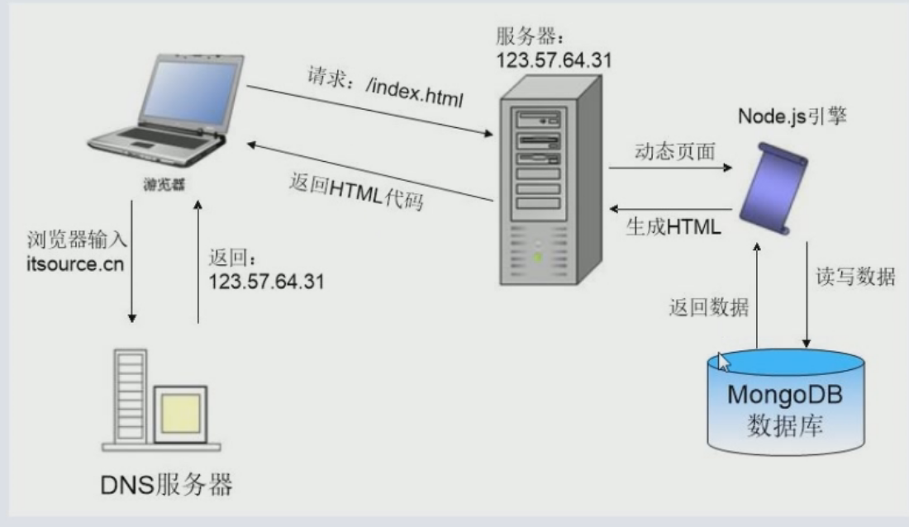

# 网址路径与http模块

## path路径模块

path 用于转换和处理路径，用于格式化和拼接一个完整的路径

path常用的方法和属性

- path.normalize() : 规范化路径

```js
const path = require("path");

let p1 = path.normalize('../path/../path/../path/a.html');
console.log(p1);//..\path\a.html
```

- path.join() : 将多个字符串拼接成完整的路径

```js
const path = require('path');
let p1 = './code/hello.html';
let pa = path.join('html', p1);
console.log(pa);//html\code\hello.html
```

我们常用的拼接 ```path.join(_dirname, p2);```

- path.dirname() : 返回文件夹名部分

```js
const path = require('path');
let p = 'code/hello/good/fine/hello.html';
console.log( path.dirname(p) );//code/hello/good/fine
```

- path.basename() : 返回最后的文件名
- path.extname() ： 返回文件名中的拓展名部分

- path.parse() : 解析路径，返回一个对象，包含路径中的各个部分

```js
const path = require('path');
let res = path.parse('../data/hello/word/hello.html');
console.log(res);
/*
{root: '', dir: '../data/hello/word', base: 'hello.html', ext: '.html', name: 'hello'}
root 是根目录
*/
```

### URL 模块

url :全球统一资源定位符也称为网址

一个URL字符串是一个结构化的字符串他包含多个有意义的组成部分，当它被解析时，返回一个URL对象


url 的构成：

完整： 协议://用户名:密码@主机名.名.域:端口号/目录名/文件名.拓展名?参数名=参数值#hash

http协议的常见结构 ： ```http://主机名.名.域/目录名/文件名.拓展名```

当没有文件名的时候，默认的是index.html

http 的 默认端口是 ： 80； https 的 默认端口是 ： 443

在nodejs中，提供了两套对URL进行处理的API(上面那张图片：上面的是老API，下面的是新的)

- 老的API;

```js
const url = require('url');
let u1 = 'http://www.google.com:80/hello/hello.txt';
console.log(url.parse(u1));//{protocol: 'http:', slashes: true, auth: null, host: 'www.google.com:80', port: '80'}
```

- 新的API(符合whatwg标准);

```js
const {URL} = require('url');
const u1 = 'https://www.baidu,com?id=10#display';
console.log(new URL(u1));// {Symbol(context): URLContext, Symbol(query): URLSearchParams}
```

```js
const {URL} = require('url');
const u1 = 'https://www.baidu.com:80?id=10#display';
console.log(new URL(u1).host);// www.baidu.com:80
```

- url.hash : 获取URL分段的hash部分
- url.host : 获取host部分
- url.hostname : 获取主机名

## http协议

- HTTP(超文本传输协议)，他是TCP/IP之上的一个应用层协议用于定义浏览器和服务器之间的交换数据的过程和数据的格式
- http是一种网络传输协议 采用的是 请求 / 应答 方式传递数据

http协议规定的细节：

- 一问一答，默认情况下，服务器不能主动向客户端发送数据(一次请求对应一次响应 --》 一一对应)

- 定义了浏览器一什么格式向浏览器发送请求
- 定义了服务器一什么格式解析请求
- 定义了服务器一什么格式响应浏览器
- 定义了浏览器以什么格式解析服务器的响应

软件开发模式：

- 单机软件开发 ： 打开电脑就能用(例如sublime word)
- C/S 软件开发： client(客户端)/server : 需要下载安装，链接网络才能使用(迅雷 QQ 微信)
- B/S 模式 ：browser（浏览器）/server ： 打开网址，直接使用。(百度 淘宝 京东)

### http通信原理



### http模块

http模块用作网络通信

#### http.get 方法

get用于从服务器获取数据(后端是没有跨域问题的)

语法：

```js
http.get(url, (res) => {
  //todo
})
```

res是响应对象，它接收到服务器响应的所有内容

```js
var http = require('http');
http.get('http://baidu.com', (res) => {
  console.log(res);
})
```

用流的方式打印源代码：

```js
var http = require('http');
http.get('http://www.behrfklewjfkle.com', (res) => {
  res.on('data', (data) => {
    console.log(data.toString());
  })
})
```
